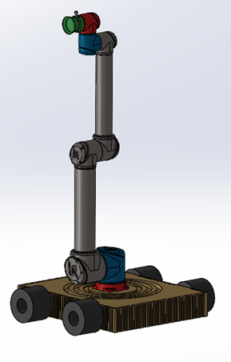
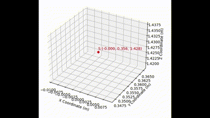

# ENPM662 Introduction to Robot Modeling
## Hand-E Robot  
A four wheeled Robot with differential drive system with manipulator arm on its base to help assist tasks in and industrial environment.  

<p align="center">
  
</p>
## Project Members
- Venkata Sai Sricharan Kasturi - UID: 119444788
- Datta Lohith Gannavarapu - UID: 119455395

## Contents of the zip file

- hand_e(ros package)
  - include/hand_e
  - config
    -control.yaml
  - launch
    - debug.launch.py
    - display.launch.py
    - gazebo.launch.py
    - [spawn_robot_ros2.launch.py](hand_e/launch/spawn_robot_ros2.launch.py)
    - robot_description_publisher.py
  - meshes
  - rviz
  - src
    - [get_hammer.py](hand_e/src/get_hammer.py)
    - [hand_e_teleop.py](hand_e/src/hand_e_teleop.py)
    - [manipulator_teleop.py](hand_e/src/manipulator_teleop.py)
    - move_hand_e.py
  - urdf
  - worlds
  - CMakeLists.txt
  - package.xml
- odometry(ros package)

## Prerequisties
- Ubuntu 20.04 LTS
- ROS Galactic(ROS2)
- Gazebo11

## Dependencies
- python 3.8
- Visual studio code

## Libraries
- ROS
  - import rclpy
  - import sys
  - import select
  - import tty
  - import termios
  - import tkinter as tk
  - import sympy as sp
  - from rclpy.node import Node
  - from std_msgs.msg import Float64MultiArray
  - from sensor_msgs.msg import JointState
  - from tkinter import ttk
  - from std_srvs.srv import SetBool
  - from time import sleep
  - from std_srvs.srv import SetBool

## Workspace Setup(paste the following commands line by line)
```bash
$ mkdir Hand_E_WS/src
$ cd Hand_E_WS/src
```
Download the `hand_e`(ros package) and `odometry`(ros package) into `src` folder
```bash
$ cd Hand_E_WS
$ colcon build
$ source install/setup.bash
```

## How to run the code

- Install Python 3 and the libraries mentinoned above
- Uncomment line `29` and `30` in `spawn_robot_ros2.launch.py` for Hand-E to be in position to test the functionality
- Run the following Commands:    
```bash
$ ros2 launch hand_e gazebo.launch.py
$ ros2 run hand_e get_hammer.py 
```
- Teleop Operations
  - Run the following commands to perform Teleop Operation on Hand-E
```bash
$ ros2 launch hand_e gazebo.launch.py
$ ros2 run hand_e hand_e_teleop.py 
```
  - Run the Following commands to perform Teleop Operation on Hand-E Manipulator
```bash
$ ros2 launch hand_e gazebo.launch.py
$ ros2 run hand_e manipulator_teleop.py 
```

## Results
### Task1 

 

### Task2 
 

### Trajectory 
 


`Here is a link to the presentation file`

- ### [Presentation](https://docs.google.com/presentation/d/1l9m1tySNcwTaT_k3cQalH2BOrhLDektQ/edit?usp=drive_link&ouid=104694076089026008591&rtpof=true&sd=true)
